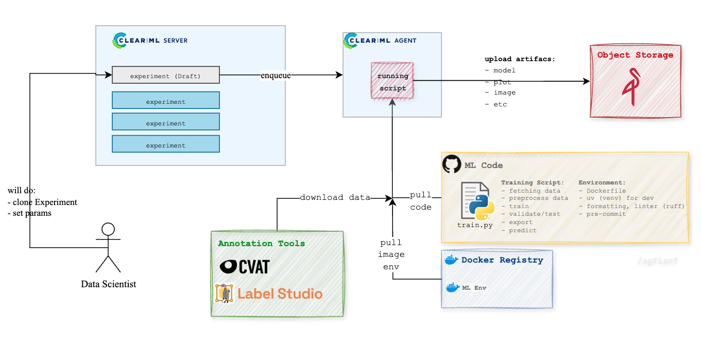

# Ultralytics YOLOv8 + ClearML Template



A robust, reproducible template for training Ultralytics YOLOv8/YOLO11 models with full [ClearML](https://clear.ml/) integration. This project enables experiment tracking, dataset management, model registration, and remote execution, supporting multiple data sources and advanced data filtering.

## Features


- **Ultralytics YOLOv8**: Train, validate, export, and predict with the latest YOLO models.
- **ClearML Integration**:
  - Experiment tracking (metrics, hyperparameters, logs, plots, debug images)
  - Model registration/versioning
  - Remote execution via ClearML Agent
  - Parameter management via ClearML UI
- **Flexible Data Sources**:
  - CVAT (API v1 & v2)
  - S3/MinIO (basic support)
  - (Planned) Label Studio, Roboflow
- **COCO to YOLO Conversion**: Automatic conversion and dataset structuring.
- **Advanced Filtering**: Exclude classes, filter by annotation attributes, or segment area.
- **Configurable**: All parameters managed via Python config and ClearML UI.
- **Prediction Visualization**: Logs prediction grids to ClearML after training.

## Project Structure

- `src/train.py`: Main entry point. Orchestrates ClearML, data handling, training, validation, export, and prediction.
- `src/yolov8/data.py`: DataHandler for downloading, converting, and preparing datasets.
- `src/yolov8/callbacks.py`: Custom ClearML callbacks for logging and model registration.
- `src/yolov8/exporter.py`: Handles model export logic.
- `src/data/converter/coco2yolo.py`: COCO to YOLO format conversion.
- `src/data/downloader/method/`: Downloaders for CVAT, S3, etc.
- `src/data/setup.py`: Dataset splitting and YAML generation.
- `src/utils/clearml_settings.py`: ClearML task initialization and parameter connection.
- `src/params.py`: Default configuration for all pipeline parameters.
- `src/schema/params.py`: Pydantic models for parameter validation.

## Usage

1. **Run the training pipeline**
    ```bash
    python src/train.py
    ```
    - This will create a ClearML task, download and prepare data, train the model, validate, export, and log predictions.

2. **Remote Execution**
    - After the first run, clone the task in the ClearML UI, modify parameters as needed, and enqueue for remote execution on a ClearML Agent.

3. **Experiment Tracking**
    - All metrics, plots, debug images, and models are logged to ClearML for easy comparison and reproducibility.

## Data Handling

- **CVAT**: Specify task IDs in `src/params.py` (`args_data["cvat"]["task_ids_train"]` etc.). The pipeline downloads, extracts, and converts the data.
- **S3/MinIO**: Specify S3 URIs. (Detection/segmentation support may require further customization.)
- **Filtering**: Use `class_exclude`, `attributes_exclude`, and `area_segment_min` in `args_data` to filter data before training.

## Model Export & Prediction

- After training, the **best** and **last** models are exported and registered to ClearML.
- The pipeline runs predictions on a sample of validation/test images and logs the results as image grids to ClearML.

## Customization

- All pipeline parameters (model, data, augmentation, training, validation, export, prediction) are defined in `src/params.py` and can be overridden in the ClearML UI.
- Extend data downloaders or converters as needed for your workflow.

## TODO

- [ ] Resume training from registered model
- [ ] Predict-only mode
- [ ] Full Label Studio and Roboflow integration
- [ ] More comprehensive data plots and reports
- [ ] Enhanced S3/MinIO support for detection/segmentation

---

**For more details, see the docstrings in each module and comments in `src/train.py`.**