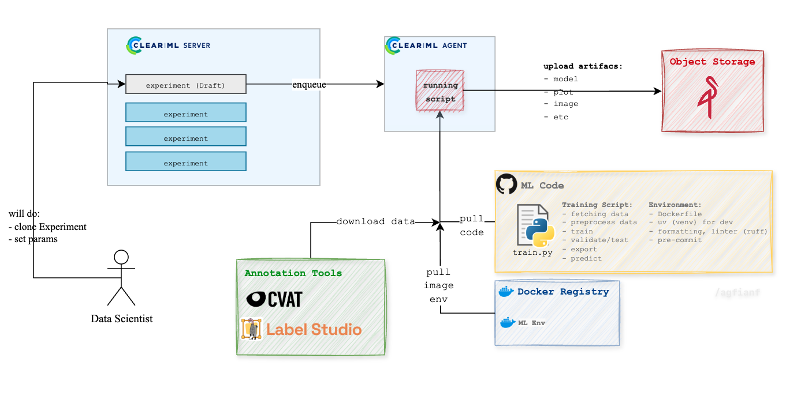

# Ultralytics YOLOv8 + ClearML Template



A robust, reproducible template for training Ultralytics YOLOv8/YOLO11 models with full [ClearML](https://clear.ml/) integration. This project enables experiment tracking, dataset management, model registration, and remote execution, supporting multiple data sources and advanced data filtering.

## Features


- **Ultralytics YOLOv8**: Train, validate, export, and predict with the latest YOLO models.
- **ClearML Integration**:
  - Experiment tracking (metrics, hyperparameters, logs, plots, debug images)
  - Model registration/versioning
  - Remote execution via ClearML Agent
  - Parameter management via ClearML UI
  - **Interactive visualizations** (confusion matrices, PR curves, per-class metrics)
- **Flexible Data Sources**:
  - CVAT (API v1 & v2)
  - S3/MinIO (basic support)
  - (Planned) Label Studio, Roboflow
- **COCO to YOLO Conversion**: Automatic conversion and dataset structuring.
- **Advanced Filtering**: Exclude classes, filter by annotation attributes, or segment area.
- **Configurable**: All parameters managed via Python config and ClearML UI.
- **Prediction Visualization**: Logs prediction grids and confidence histograms to ClearML after training.

## Project Structure

- `src/train.py`: Main entry point. Orchestrates ClearML, data handling, training, validation, export, and prediction.
- `src/yolov8/data.py`: DataHandler for downloading, converting, and preparing datasets.
- `src/yolov8/callbacks.py`: Custom ClearML callbacks for logging and model registration.
- `src/yolov8/clearml_logger.py`: Wrapper class for ClearML logging (interactive plots, tables, histograms).
- `src/yolov8/metrics_utils.py`: Utility functions for extracting metrics from trainer/validator.
- `src/yolov8/exporter.py`: Handles model export logic.
- `src/data/converter/coco2yolo.py`: COCO to YOLO format conversion.
- `src/data/downloader/method/`: Downloaders for CVAT, S3, etc.
- `src/data/setup.py`: Dataset splitting and YAML generation.
- `src/utils/clearml_settings.py`: ClearML task initialization and parameter connection.
- `src/params.py`: Default configuration for all pipeline parameters.
- `src/schema/params.py`: Pydantic models for parameter validation.

## Usage

1. **Run the training pipeline**
    ```bash
    python src/train.py
    ```
    - This will create a ClearML task, download and prepare data, train the model, validate, export, and log predictions.

2. **Remote Execution**
    - After the first run, clone the task in the ClearML UI, modify parameters as needed, and enqueue for remote execution on a ClearML Agent.

3. **Experiment Tracking**
    - All metrics, plots, debug images, and models are logged to ClearML for easy comparison and reproducibility.

## ClearML Visualization & Metrics

This template provides enhanced visualization and metrics logging to ClearML. All features are configurable via the `8_Visualization` parameter section in ClearML UI.

### Visualization Features

| Feature | Description | ClearML Location |
|---------|-------------|------------------|
| Interactive Confusion Matrix | Clickable heatmap with normalized and count views | Plots tab |
| Interactive PR Curves | Plotly-based precision-recall curves with tooltips | Plots tab |
| Per-Class Metrics Table | DataFrame with P, R, mAP50, mAP50-95 per class | Tables tab |
| Per-Class Bar Charts | Visual comparison of metrics across classes | Plots tab |
| Confidence Histograms | Distribution of prediction confidence scores | Debug Samples |
| Learning Rate Tracking | LR values per epoch for each param group | Scalars tab |
| Loss Components | Separate box, cls, dfl loss tracking | Scalars tab |
| Speed Metrics | Preprocess, inference, postprocess timing | Scalars tab |

### ClearML UI Organization

**Scalars Tab:**
```
Metrics/Summary/fitness
Metrics/Precision/precision(B), precision(M)
Metrics/Recall/recall(B), recall(M)
Metrics/mAP/mAP50(B), mAP50-95(B)
Losses/Train/box_loss, cls_loss, dfl_loss
Losses/Validation/val/box_loss, val/cls_loss, val/dfl_loss
Learning Rate/param_group_0, param_group_1
Speed/Training/epoch_time_seconds
Speed/Inference/preprocess_ms, inference_ms, postprocess_ms
```

**Plots Tab:**
```
Confusion Matrix/Normalized, Counts (interactive)
PR Curves/All Classes (interactive Plotly)
Per-Class Performance/mAP50, Precision, Recall (bar charts)
```

**Tables Tab:**
```
Per-Class Metrics/Detailed (Class, Precision, Recall, mAP50, mAP50-95)
```

### Configuration

All visualization features can be toggled in `src/params.py` or via ClearML UI:

```python
args_visualization = {
    "log_interactive_confusion_matrix": True,  # Interactive confusion matrices
    "log_per_class_table": True,               # Per-class metrics table
    "log_interactive_pr_curves": True,         # Plotly PR curves
    "log_confidence_histograms": True,         # Confidence distributions
    "log_learning_rate": True,                 # LR tracking per epoch
    "log_loss_components": True,               # Separate loss logging
    "log_speed_metrics": True,                 # Inference timing
    "log_per_class_scatter": True,             # Per-class bar charts
}
```

## Data Handling

- **CVAT**: Name whole projects (`project_ids_train`) or individual tasks (`task_ids_train`) in `args_data["cvat"]` — see below. The pipeline downloads, extracts, and converts the data.
- **S3/MinIO**: Specify S3 URIs. (Detection/segmentation support may require further customization.)
- **Filtering**: Use `class_exclude`, `attributes_exclude`, and `area_segment_min` in `args_data` to filter data before training.

### Choosing sources: by project or by task

Four keys in `args_data["cvat"]`, and they add up rather than replace each other:

| Key | Meaning |
|---|---|
| `project_ids_train` | Every task in these projects |
| `task_ids_train` | Individual tasks, on top of whatever the projects expand to |
| `project_ids_test` | Every task in these projects, as the test split |
| `task_ids_test` | Individual test tasks |

**Test tasks are always subtracted from training.** That is the point of the
project option: the batch you set aside for testing normally lives *inside* the
training project, so expanding the project would otherwise train on it and every
metric reported on the test split would be measured against images the model had
already seen.

```python
"cvat": {
    "project_ids_train": [53],   # 8 tasks
    "task_ids_test": [1181],     # one of those 8
    "task_ids_train": [],
    "project_ids_test": [],
}
# -> train 7 task(s), test 1 task(s); 1 excluded from train as test: [1181]
```

Naming projects also means a task added in CVAT later is picked up on the next
run, instead of being silently missing because nobody updated the id list.

Two things the resolver does on its own, both reported in that one summary line:

- **Tasks with no frames are skipped** — they export an empty archive and then
  fail in the converter with a much less obvious message.
- **Tasks not yet in `completed` status are counted and named.** They are still
  included, because "annotation" is the normal state of a task in active use, but
  a partially annotated image teaches the model that a real object is background.
  If the count surprises you, that is the number to look at.

### Class order across sources

A YOLO label file stores a class *index*; COCO stores a category *id*, and CVAT
hands those out per project. Two projects annotated with the same label names
still export them in a different order, and a project that never saw a label
simply omits it — so the old `category_id - 1` made `car` index 0 in one task and
index 1 in the next, in the same merged dataset. Nothing errored; the model just
trained against scrambled targets.

`unify_class_order` (on by default) builds **one** name → index map before any
label file is written, from the union of every source in the run — training
tasks and the test split alike — and converts every source through it. Matching
ignores case and surrounding whitespace. The map is logged as a single line:

```
class map (derived): 3 classes -> 0:car, 1:person, 2:speed_limit
```

| Key in `args_data` | Meaning |
|---|---|
| `unify_class_order` | `True` (default) for the shared map. `False` restores the per-source numbering, and warns if the sources disagree — for reproducing an older run, nothing else. |
| `class_names` | Pinned order, comma-separated. Empty (default) derives it: the union of every source, sorted. |
| `on_unknown_class` | `error` (default) or `drop`, for a class the pinned list does not mention. Unreachable when `class_names` is empty. |

Two things worth knowing before a fine-tune:

- **A derived order is reproducible across runs, not across a change to the class
  list.** Rerunning the same tasks in any order gives the same map, but a new
  label sorts into the middle and shifts every index after it. Pin `class_names`
  to the checkpoint's own `names` before training on top of it.
- **Excluded classes take no index.** `class_exclude` removes them from the map
  entirely, so `nc` counts only classes that can actually appear.

## Model Export & Prediction

- After training, the **best** and **last** models are exported and registered to ClearML.
- The pipeline runs predictions on a sample of validation/test images and logs the results as image grids to ClearML.

## Customization

- All pipeline parameters (model, data, augmentation, training, validation, export, prediction) are defined in `src/params.py` and can be overridden in the ClearML UI.
- Extend data downloaders or converters as needed for your workflow.

## TODO

- [ ] Resume training from registered model
- [ ] Predict-only mode
- [ ] Full Label Studio and Roboflow integration
- [x] ~~More comprehensive data plots and reports~~ (Interactive visualizations added)
- [ ] Enhanced S3/MinIO support for detection/segmentation

---

**For more details, see the docstrings in each module and comments in `src/train.py`.**